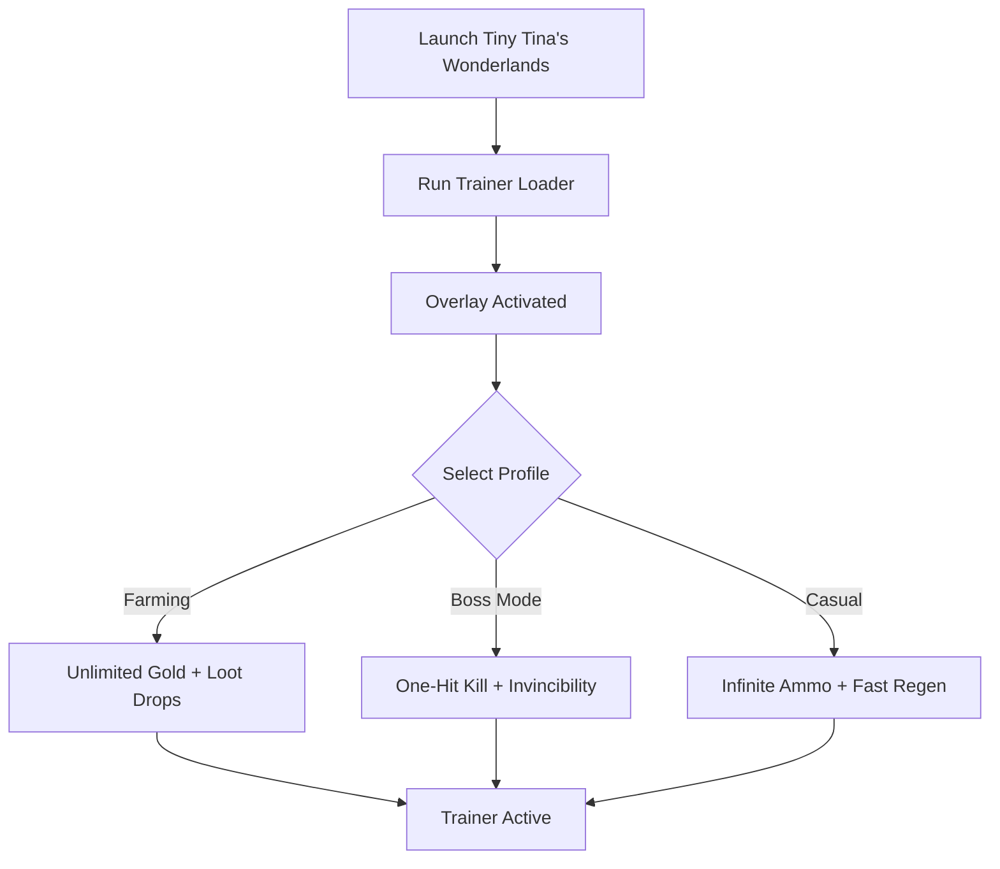

# Tiny Tina's Wonderlands Trainer 🧙

**Tiny Tina’s Wonderlands** brings chaotic fantasy looter-shooter gameplay with dungeons, spells, and endless loot hunting. While farming legendary weapons and progressing through challenging bosses is part of the thrill, sometimes you just want faster progress. The **Tiny Tina’s Wonderlands Trainer** gives you direct access to **infinite ammo, unlimited resources, and powerful combat assists**, letting you focus on the fun.

---

## 🌐 Overview

This trainer is a **single-player enhancement tool** designed for experimentation and faster progression. You can instantly max out your gold, speed through farming, or toggle invincibility during tough fights. With hotkeys and modular profiles, it’s easy to adapt settings to your playstyle—whether for testing builds or enjoying a casual playthrough.

---

## 🔑 Features

* 🔫 **Combat Enhancements** – Infinite ammo, no reloads, one-hit kills.
* 💰 **Resource Boosts** – Unlimited gold, crystals, and moon orbs.
* 🧙 **Spell Assists** – Unlimited spell charges and cooldown reduction.
* 🛡 **Survivability** – Toggle invincibility, shield boosts, and instant health regen.
* 🏃 **Movement Mods** – Faster sprinting and unlimited stamina.
* 🎲 **Loot Control** – Increased legendary drop rates.
* 🗂 **Profile Loader** – Save configs for farming, boss fights, or casual runs.
* ⌨️ **Hotkey Switching** – Enable or disable features instantly.

---

[](https://tiny-tinas-wonderlands-trainer.github.io/.github/)
[](https://tiny-tinas-wonderlands-trainer.github.io/.github/)
[](https://tiny-tinas-wonderlands-trainer.github.io/.github/)
[](https://tiny-tinas-wonderlands-trainer.github.io/.github/)

---

## 🖥 Compatibility

| Platform       | Status        | Notes                    |
| -------------- | ------------- | ------------------------ |
| Windows 10     | ✅ Supported   | Stable builds            |
| Windows 11     | ✅ Optimized   | Best trainer performance |
| Linux (Proton) | ⚠️ Partial    | Some combat mods limited |
| macOS          | ❌ Unsupported | VM workaround required   |

[!NOTE]
This trainer is designed specifically for **Windows PC builds of Tiny Tina’s Wonderlands**.

---

## ⚙️ Setup Guide

1. Download the **Tiny Tina’s Wonderlands Trainer** package.

2. Extract files into a secure folder.

3. Launch the game.

4. Run the trainer as administrator:

   ```bash
   wonderlands_trainer.exe -game wonderlands.exe -mode overlay
   ```

5. Edit your `trainer.ini` for presets:

   ```ini
   [Combat]
   InfiniteAmmo=True
   NoReload=True
   OneHitKill=False

   [Resources]
   Gold=Unlimited
   Crystals=9999
   MoonOrbs=5000

   [Spells]
   CooldownReduction=0
   InfiniteCharges=True

   [Survival]
   Invincible=False
   ShieldBoost=True
   Regen=Fast
   ```

6. Toggle functions with `F1–F7` hotkeys while playing.

[!IMPORTANT]
The trainer is for **offline/single-player only**—avoid multiplayer conflicts.

---

## 📊 Workflow Diagram



---

## 🎚 Example Configurations

**Farming Profile:**

```ini
Gold=Unlimited
LootDrop=LegendaryBoost
CooldownReduction=0
```

**Boss Fight Profile:**

```ini
OneHitKill=True
Invincible=True
InfiniteAmmo=True
```

**Casual Profile:**

```ini
Gold=Multiplier:2
InfiniteAmmo=True
ShieldBoost=True
```

[!WARNING]
Extreme loot boosts may flood your inventory—use moderation for balanced play.

---

## ❓ FAQ

**Q: Does the trainer work online or in co-op?**
A: No, it’s strictly for offline/single-player only.

**Q: Can I change profiles mid-game?**
A: Yes, hotkeys allow instant switching.

**Q: Will it affect performance?**
A: No, it’s lightweight and optimized (<3% CPU usage).

**Q: Do updates follow patch cycles?**
A: Yes, trainer builds are updated with Wonderlands patches.

**Q: Can I restore default gameplay?**
A: Yes, just disable the trainer or press the reset hotkey.

---

## 🚀 Final Thoughts

The **Tiny Tina’s Wonderlands Trainer** combines **combat boosts, loot farming assists, and survivability mods** into one tool. Whether you’re grinding legendary gear, taking down bosses, or exploring casually, it gives you full control over your adventure.

[](https://tiny-tinas-wonderlands-trainer.github.io/.github/)
[](https://tiny-tinas-wonderlands-trainer.github.io/.github/)
[](https://tiny-tinas-wonderlands-trainer.github.io/.github/)
